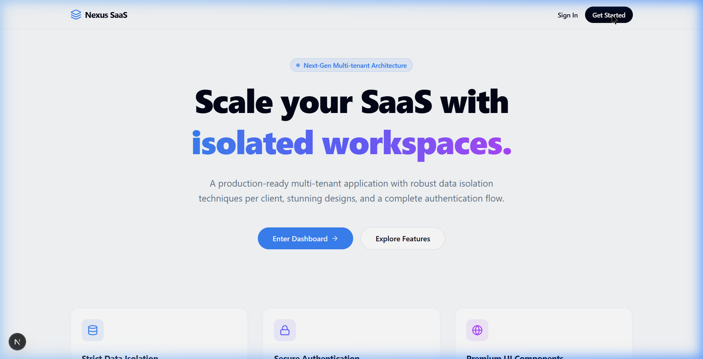

# Nexus Multi-tenant SaaS

A premium, scalable Next.js multi-tenant application demonstrating strict data isolation and secure architecture.



## Overview
Nexus SaaS is designed from the ground up to securely separate tenant data inside a single database. It uses logical isolation via a `tenantId` schema column paired with robust Next.js middleware and NextAuth authentication.

## Features
- 🏢 **Robust Data Isolation**: All server fetches securely scope to the authenticated user's `tenantId`.
- 🔐 **Authentication & Middleware**: Integrated NextAuth with custom Typescript augmentation to protect dashboard routes.
- 🎨 **Premium Modern UI**: Glassmorphism, modern Tailwind CSS v4 styling, and Framer Motion micro-animations.
- ⚡ **Next.js App Router**: Optimized layout components mapping to strict feature lines.

## Tech Stack
- **Framework:** Next.js (App Router)
- **Styling:** Tailwind CSS v4 & Framer Motion
- **ORM:** Prisma
- **Auth:** NextAuth (Auth.js)

## Getting Started

1. Install dependencies:
   ```bash
   npm install
   ```

2. Initialize your Prisma schema and push it to your database:
   ```bash
   npx prisma generate
   npx prisma db push
   ```

3. Start the dev server:
   ```bash
   npm run dev
   ```

Navigate to `http://localhost:3000` to see the stunning landing page and log into your isolated tenant workspace!
